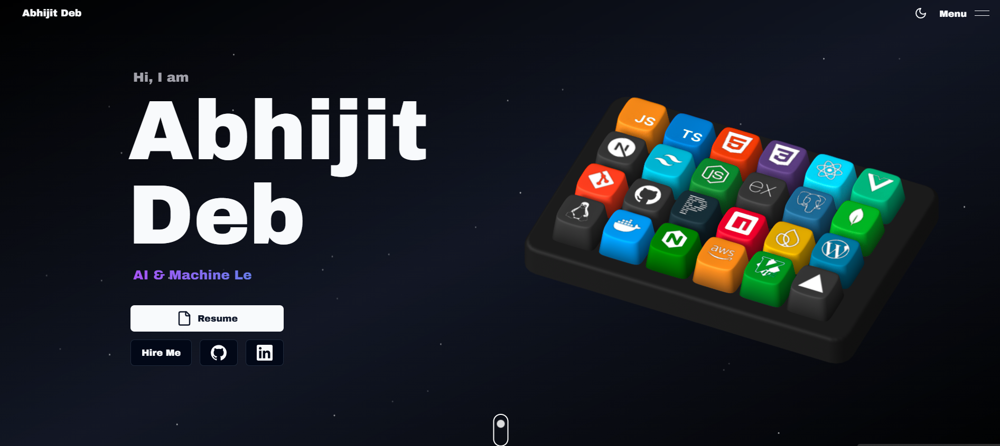

# 🚀 My Portfolio Website

Welcome to the repository for my personal portfolio website! This is where I showcase my skills, projects, and a bit of my personality through jaw-dropping 3D animations, slick interactions, and fluid motion. If you're into creative web design, you're in the right place.

**Live Site:** [View Portfolio](https://3-d-abhijit-portfolio-zwag.vercel.app)



## 🔥 Features

- **3D Animations**: Custom-made interactive keyboard using Spline with skills as keycaps that reveal titles and descriptions on hover.
- **Slick Interactions**: Powered by GSAP and Framer Motion for smooth animations on scroll, hover, and element reveal.
- **Space Theme**: Particles on a dark background to simulate a cosmic environment, making the experience out of this world.
- **COPEZONE**: A video gallery section for gaming clips with categories (Gameplay, Funny Moments), custom thumbnails, and PostgreSQL database.
- **Responsive Design**: Fully responsive across all devices to ensure the best user experience.
- **Innovative Web Design**: Combining creativity with functionality to push the boundaries of modern web design.

## 🛠️ Tech Stack

- **Frontend**: Next.js 14, React, TypeScript, Tailwind CSS, Shadcn UI, Aceternity UI
- **Database**: PostgreSQL with Prisma ORM
- **Animations**: GSAP, Framer Motion, Spline Runtime
- **Misc**: Resend, Socket.io, Zod
- **Frontend**: Next.js, React, Tailwind CSS, Shadcn, Aceternity UI
- **Animations**: GSAP, Framer Motion, Spline Runtime
- **Misc**: Resend, Socketio, Zod


## 🚀 Getting Started

### Prerequisites

- Node.js (v14+)
- npm or yarn

### Installation

1. Clone the repository:

    ```bash
     gh repo clone Abhijit-cmd/3D-abhijit-portfolio
    ```

2. Navigate to the project directory:

    ```bash
    cd Portfolio
    ```

3. Install dependencies:

    ```bash
    npm install
    # or
    yarn install
    ```
4. Set up environment variables:

    Create a `.env` file in the root directory and add:

    ```env
    DATABASE_URL="your_postgresql_connection_string"
    ```

5. Set up the database:

    ```bash
    npx prisma generate
    npx prisma migrate deploy
    ```

6. Run the development server:
=======
4. Run the development server:
>>>>>>> 5e8de245757cd94140709dcc1c105d91c3469509

    ```bash
    npm run dev
    # or
    yarn dev
    ```

7. Open [http://localhost:3000](http://localhost:3000) in your browser to see the magic!


## 🚀 Deployment

This site is deployed on Vercel. For your own deployment, follow these steps:

1. Push your code to a GitHub repository.
2. Connect your repository to Vercel.
3. Vercel will handle the deployment process.

## 🤝 Contributing

If you'd like to contribute or suggest improvements, feel free to open an issue or submit a pull request. All contributions are welcome!

## 📄 License

This project is open source and available under the [MIT License](LICENSE).
